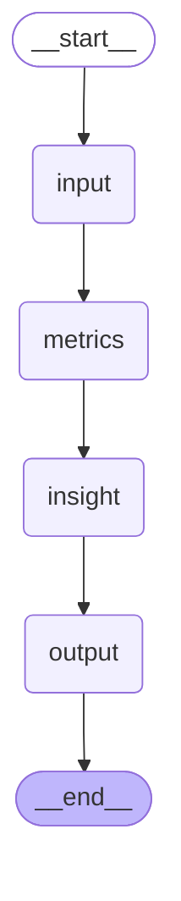

# 🧠 LangGraph Orchestration Diagram

```mermaid
---
config:
  flowchart:
    curve: linear
---
graph TD;
	__start__([<p>__start__</p>]):::first
	input(input)
	metrics(metrics)
	insight(insight)
	output(output)
	__end__([<p>__end__</p>]):::last
	__start__ --> input;
	input --> metrics;
	insight --> output;
	metrics --> insight;
	output --> __end__;
	classDef default fill:#f2f0ff,line-height:1.2
	classDef first fill-opacity:0
	classDef last fill:#bfb6fc

```